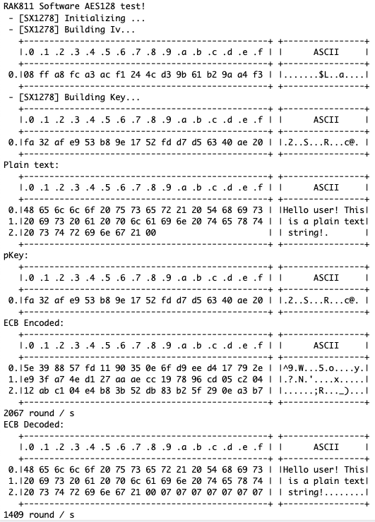
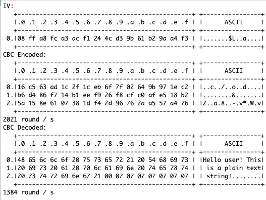
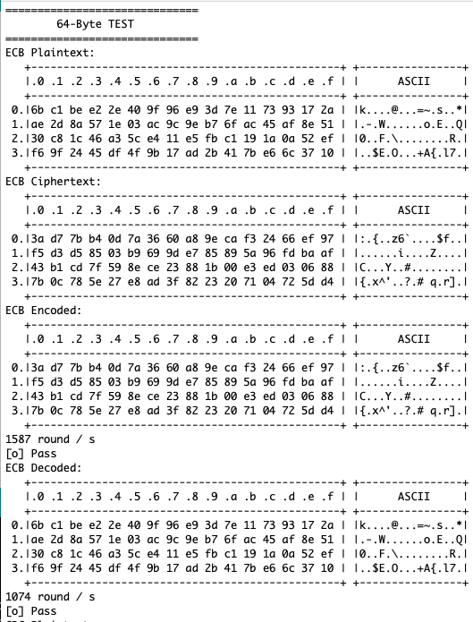
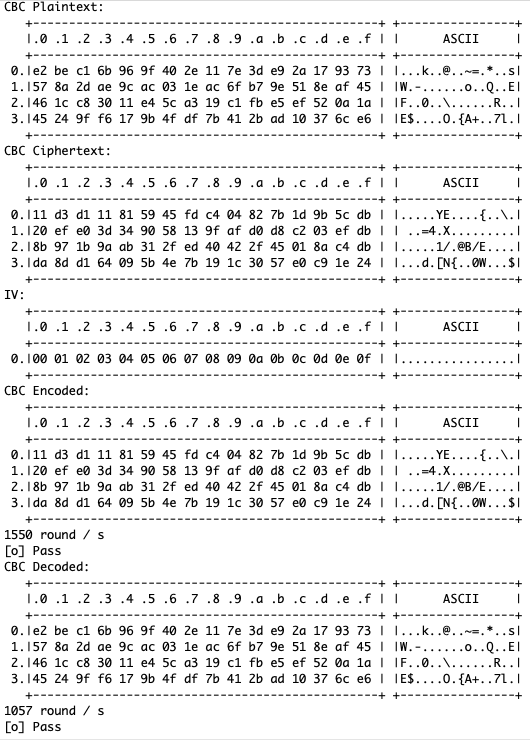

# RAK811_AES_Test

This is a software AES test I have written for many MCUs, this time targeting the RAK811 – an STM32L151CBU6 + LoRa SX1276. Which is important in this case, since I am generating the Iv and the key, in the first part of the test, with LoRa's TRNG feature. This requires my [LoRandom library](https://github.com/Kongduino/LoRandom) and Sandeep Mistry's [LoRa library](https://github.com/sandeepmistry/arduino-LoRa). You have to use both libraries, because despite numerous PR, Sandeep refused to update his library with a working Random function. His is fubared, because he never read the docs...

[THIS](https://github.com/sandeepmistry/arduino-LoRa/blob/master/src/LoRa.cpp#L674-L677) is not how random works in LoRa...

```c
byte LoRaClass::random() {
  return readRegister(REG_RSSI_WIDEBAND);
}
```

Aaaaanyway. Once you have LoRandom installed, you have a real RNG function, and you can generate random passphrases, IVs, etc. The second part of the test is adapted from a standard STM32Cube example, and tests AES 128 ECB and CBC. It checks the validity of the operations – in the first part of the test it is easy to do so visually, because it *is* plain text. Less so in the second part.

### Part 1



### Part 2


